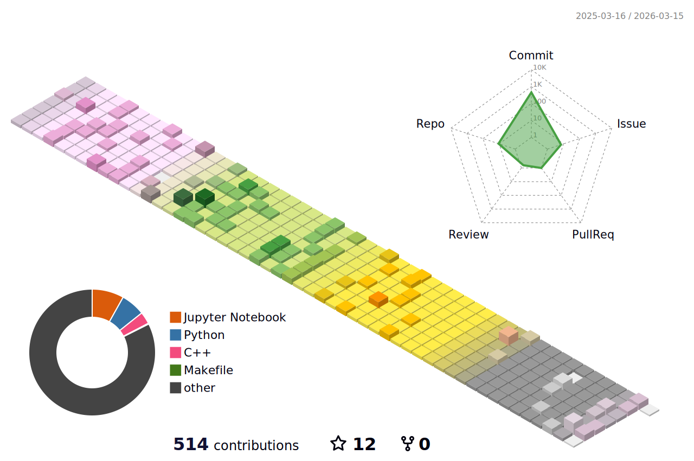

### Contact
- Email: wjdchs0129@gnu.ac.kr / leeminjae0129@gmail.com
- Location: [AI Lab](https://ailab.gnu.ac.kr/) @ Gyeongsang National University, Computer Science and Engineering.

### Introduction
I'm interested in Recognizing, Understanding, and Utilizing the "REAL WORLD SPACE", such as simultaneous localization and mapping (SLAM) and autonomous driving systems. My dream just starts from these movies: *Iron Man*, *Captain America: The Winter Soldier*, and *The Avengers*. I hope the technologies in these movies come true.

### Tech Skills and Values
- Building clean environments using Docker and Anaconda for managing multiple CUDA versions and external library dependencies.
- Writing easy-to-read code that is accessible to everyone.
- Intermediate level understanding and development of SLAM systems.
- Experienced with Pytorch for deep learning (enhanced with ChatGPT).
- Developing applications based on Mediapipe (e.g., Human Pose and Hand Pose Estimation).
- Familiar with OS: Windows (10+), Ubuntu (18.04+).
- Proficient in Python for fast development, testing, and visualization (prefer Python 3.6+).
- C++ development for high-performance applications (prefer C++14+).
- Experienced with Unity (C#) for AR systems and 3D visualization (familiar with camera models, including intrinsic and extrinsic parameters).
- FastAPI-based front-end/back-end development and deployment.
- Flutter based mobile application development.

### Papers (links will be updated soon)
- **Shrunken Reality**: Augmenting Real-World Contexts in Real-Time on Realistic Miniature Dioramas (SIGGRAPH ASIA 2024, Short Paper)
- **Finger-Pointing Interface for Human Gesture Recognition Based on Real-Time Geometric Comprehension** (SIGGRAPH ASIA 2024, Poster)
- **SLAM-Based Illegal Parking Detection System** (SIGGRAPH ASIA 2024, Poster)

<!--
**MinChoi0129/MinChoi0129** is a ✨ _special_ ✨ repository because its `README.md` (this file) appears on your GitHub profile.

Here are some ideas to get you started:

- 🔭 I’m currently working on ...
- 🌱 I’m currently learning ...
- 👯 I’m looking to collaborate on ...
- 🤔 I’m looking for help with ...
- 💬 Ask me about ...
- 📫 How to reach me: ...
- 😄 Pronouns: ...
- ⚡ Fun fact: ...
-->
