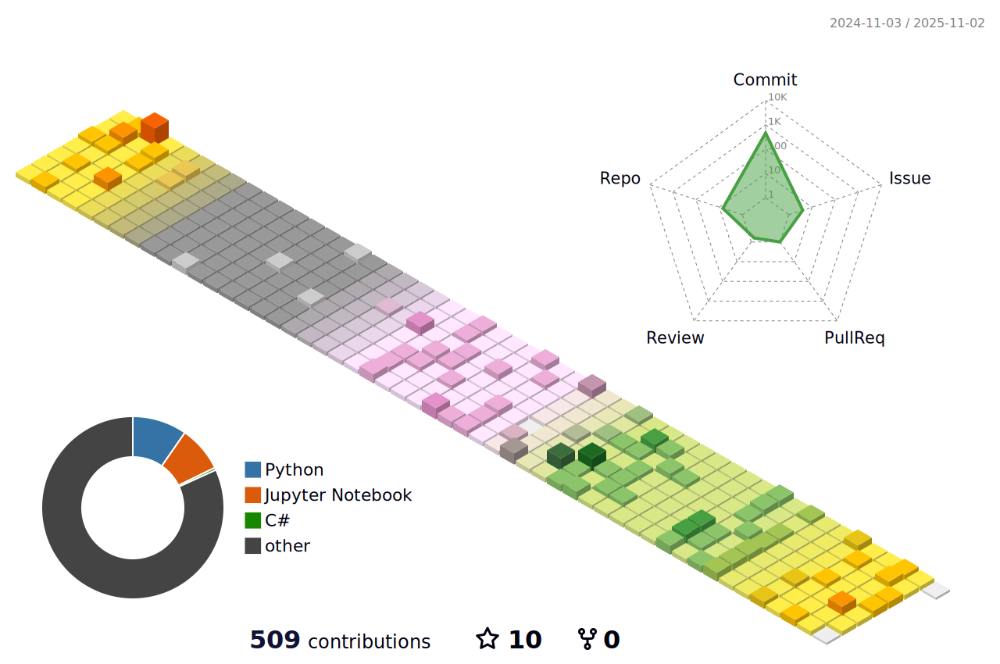

Interested in recognizing, understanding and utilizing the REAL WORLD SPACE, such as simultaneous localization and mapping (SLAM) and autonomous driving system.

- Familiar with Windows(10+), Ubuntu OS(18.04+).
- Pursuing clean environments using Docker and Anaconda for dependencies.
- Pursuing easy-to-read code for everyone.
- Python based fast development skill for quick and simple tests and visualizations. (prefer 3.6+)
- C++ based development if faster performance is required. (prefer C++14+)
- Unity(C#) based AR system, 3D Visualization. (familiar with camera model such as in/extrinsic parameters)
- FastAPI based frontend/backend development with deployment.

<!--
**MinChoi0129/MinChoi0129** is a ✨ _special_ ✨ repository because its `README.md` (this file) appears on your GitHub profile.

Here are some ideas to get you started:

- 🔭 I’m currently working on ...
- 🌱 I’m currently learning ...
- 👯 I’m looking to collaborate on ...
- 🤔 I’m looking for help with ...
- 💬 Ask me about ...
- 📫 How to reach me: ...
- 😄 Pronouns: ...
- ⚡ Fun fact: ...
-->
